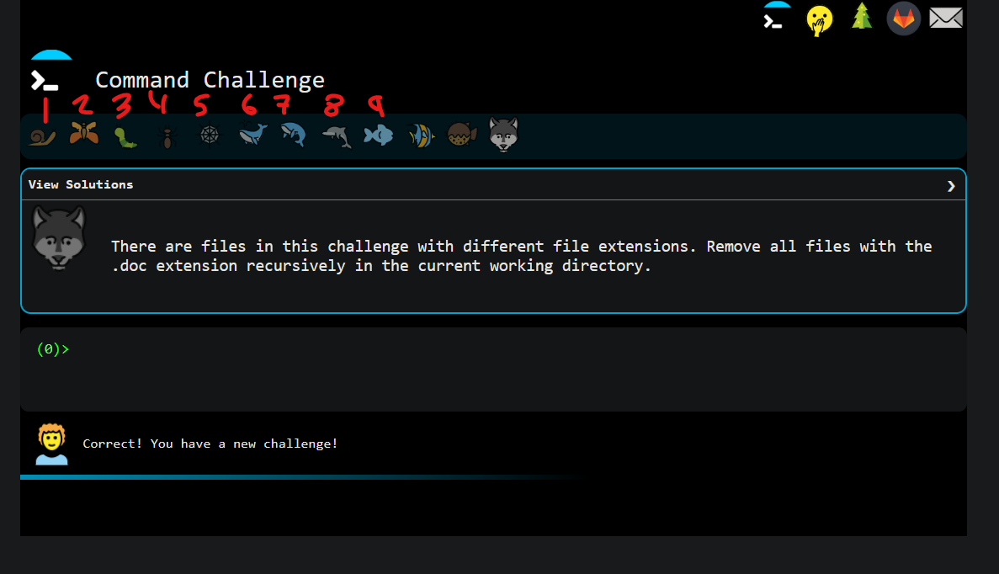
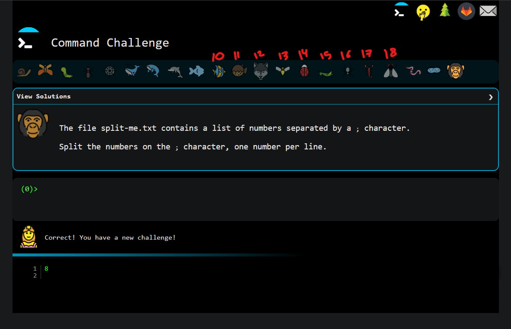
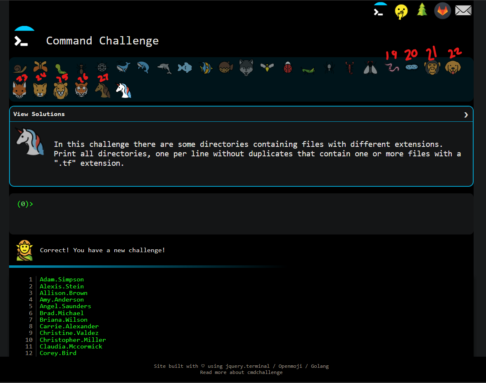

# Command line for the win
hello :]
## 0. First 九 tasks

## 1. Reach חי completed tasks

## 2. Reach the perfect cube, 27

# How To Use SFTP to remotly copy files
1. Use `sftp` command to connect using hostname  
    `sftp 123@xx.alx-cod.online`
2. Type in your server password
3. Congrats now your are connected over sftp to your server, you should see `sftp>`
4. use `help` command to further explore `sftp` tool
5. make your final directory
    `mkdir /root/alx-system_engineering-devops/`  
    `mkdir /root/alx-system_engineering-devops/command_line_for_the_win/`  
6. cd there `cd /root/alx-system_engineering-devops/command_line_for_the_win/`
7. Use put command to finally upload with the screeshot path
    `put [path]`  
    `put C:/Users/xd/Desktop/from18to27.png`